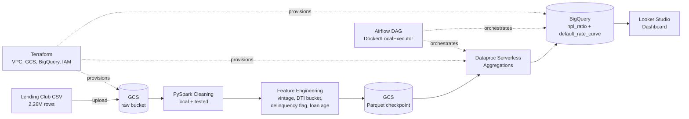

# Credit Risk Batch Pipeline

A batch data engineering pipeline that ingests the Lending Club loan dataset, cleans and enriches it with credit-risk features, computes non-performing loan (NPL) metrics at scale, and surfaces the results in an interactive dashboard — orchestrated end-to-end on Google Cloud Platform.

---

## Overview

This project simulates a real-world credit risk analytics pipeline for a lending institution. It answers two core business questions:

1. **Which borrower segments carry the highest default risk?** (by loan grade, state, loan purpose, and vintage year)
2. **How does default risk evolve over the life of a loan?** (default rate as a function of loan age, segmented by vintage year)

The pipeline processes the full Lending Club historical dataset (~2.26M loan records, 151 columns) through cleaning, feature engineering, and aggregation stages, then loads the results into BigQuery for visualization in Looker Studio. The entire pipeline is orchestrated via Airflow running in Docker, with infrastructure provisioned through Terraform.

### Tech Stack
* **Storage & Data Warehouse:** Google Cloud Storage (GCS), BigQuery
* **Processing & Analytics:** PySpark, Dataproc Serverless
* **Orchestration & Infrastructure:** Apache Airflow, Terraform, Docker
* **BI & Dashboarding:** Looker Studio

---

## Architecture

The pipeline follows a batch ELT pattern with orchestrated, immutable execution stages:



### Design Notes

* **Local-to-Cloud Split:** Cleaning and feature engineering run locally during development because the dataset fits in single-machine memory. Only the compute-heavy aggregation stage (joins & group-bys) offloads to Dataproc Serverless.
* **Terraform vs. Airflow Scope:** Dataproc Serverless batches are immutable, one-shot executions, making them a poor fit for Terraform's state reconciliation model. Terraform provisions static infrastructure (VPC, GCS, BigQuery, IAM); Airflow owns recurring pipeline execution via `gcloud dataproc batches submit`.
* **Cost-Free Orchestration:** Airflow runs self-hosted in Docker (instead of Cloud Composer) using `network_mode: host` to eliminate cloud orchestration costs and ensure 100% local reproducibility.
* **Custom Alerting:** Failure alerting uses an explicit `on_failure_callback` rather than Airflow's built-in `email_on_failure`, which silently no-op'd under certain Linux container bridge network environments.

---

## Data Dictionary

Below are key columns engineered or transformed by the pipeline (source raw schemas are referenced in `schema/`).

### Engineered Features

| Column | Type | Description |
|---|---|---|
| `is_default` | boolean (0/1) | Target label. `1` = Charged Off, `0` = Fully Paid. Filtered to resolved statuses only. |
| `vintage_year` | integer | Year the loan originated (extracted from `issue_d`). Used for cohort analysis. |
| `loan_age_months` | integer | Months between loan issue date and last payment/status date. |
| `dti_bucket` | string | Categorical debt-to-income tier: `Low`, `Moderate`, `High`, or `Unknown`. |
| `delinquency_flag` | boolean / null | `True` (has delinquency history), `False` (clean history), or `null` (missing data). |

### Output Tables (BigQuery)

#### `npl_ratio_by_dimension`
Long-format non-performing loan (NPL) ratio table, unioned across four key dimensions:

| Column | Type | Description |
|---|---|---|
| `dimension` | string | One of `grade`, `addr_state`, `purpose`, `vintage_year`. |
| `dimension_value` | string | Target value within dimension (e.g. `A`, `CA`, `debt_consolidation`, `2015`). |
| `default_count` | integer | Count of defaulted loans within this slice. |
| `total_count` | integer | Total loan count within this slice. |
| `npl_ratio` | float | Default rate calculation (`default_count / total_count`). |

#### `default_rate_curve`
Metrics for default rate progression by loan age and vintage cohort:

| Column | Type | Description |
|---|---|---|
| `vintage_year` | integer | Origination year cohort. |
| `loan_age_months` | integer | Loan age in whole months since origination. |
| `npl_ratio` | float | Cumulative default rate at this specific age/vintage combination. |
| `total_count` | integer | Active loan count at this stage (useful for assessing sample size decay). |

---

## Visualizations & Dashboard

The BigQuery output tables feed directly into an interactive Looker Studio dashboard to analyze risk trends across portfolios and loan ages.


*Figure 1: Risk breakdown across loan grades, states, and vintage years.*


*Figure 2: Default rate progression curves by loan age in months.*

---

## Setup & Running the Pipeline

### Prerequisites
* GCP account with billing enabled
* `gcloud` CLI authenticated via Application Default Credentials (`gcloud auth application-default login`)
* Docker & Docker Compose v2 (`docker compose`)
* Terraform >= 1.x

### 1. Provision Infrastructure
```bash
cd terraform
terraform init
terraform apply
```
This sets up the GCS buckets, BigQuery dataset, VPC/Subnet/Firewall rules for Dataproc Serverless, and IAM permissions.

### 2. Configure Airflow Environment
Set the Dataproc batch configuration variable inside Airflow (`credit_risk_dataproc_config`) and populate SMTP alerting credentials:

```bash
echo "SMTP_USER=your_email@example.com" >> airflow/.env
echo "SMTP_PASSWORD=your_app_password" >> airflow/.env
```

### 3. Trigger the Pipeline
```bash
cd airflow
./run_pipeline.sh
```
This entry point boots the local Docker Compose cluster, waits for the Airflow Scheduler to register, fires the `credit_risk_dataproc_batch` DAG, and streams execution logs until completion.

### 4. Query Results
Explore the populated tables inside BigQuery or view the active dashboard in Looker Studio.

---

## Key Design Decisions & Troubleshooting

> **Why `try_cast` everywhere?**  
> PySpark 4.1.2 defaults to `spark.sql.ansi.enabled=true`, meaning plain `.cast()` calls throw runtime exceptions on malformed strings instead of returning nulls. Using `F.expr("try_cast(col as type)")` ensures dirty string records fail gracefully without breaking batch processing.

> **Why not manage Dataproc Batches in Terraform?**  
> Dataproc Serverless batches are immutable, single-execution runs requiring unique batch IDs on every attempt. Terraform’s declarative state model expects resources to persist and converge, making Airflow's `BashOperator` calling `gcloud dataproc batches submit` a much more resilient execution tool.

> **Why `on_failure_callback` over `email_on_failure`?**  
> Airflow's built-in `email_on_failure` silent-fails under specific Docker bridge driver setups. Wrapping `send_email()` inside an explicit `on_failure_callback` with `try/except` blocks guarantees full execution logs whenever alerts fire.

> **Why keep Data Quality checks out of Dataproc?**  
> Quality reports (null percentage checks, row count validation, drift analysis) run as a separate local script against Parquet checkpoints. This keeps Dataproc Serverless worker runtime focused exclusively on compute-heavy SQL aggregations.
